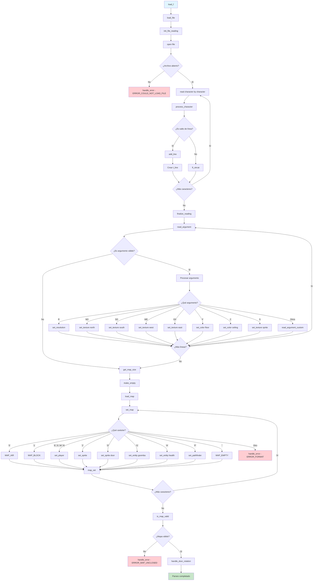
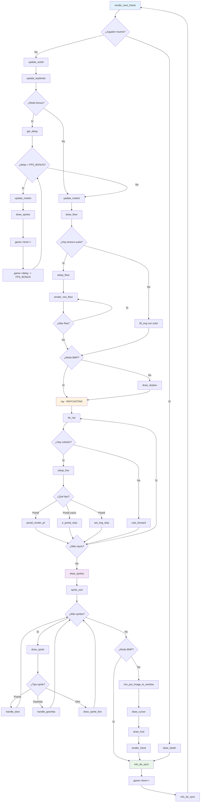
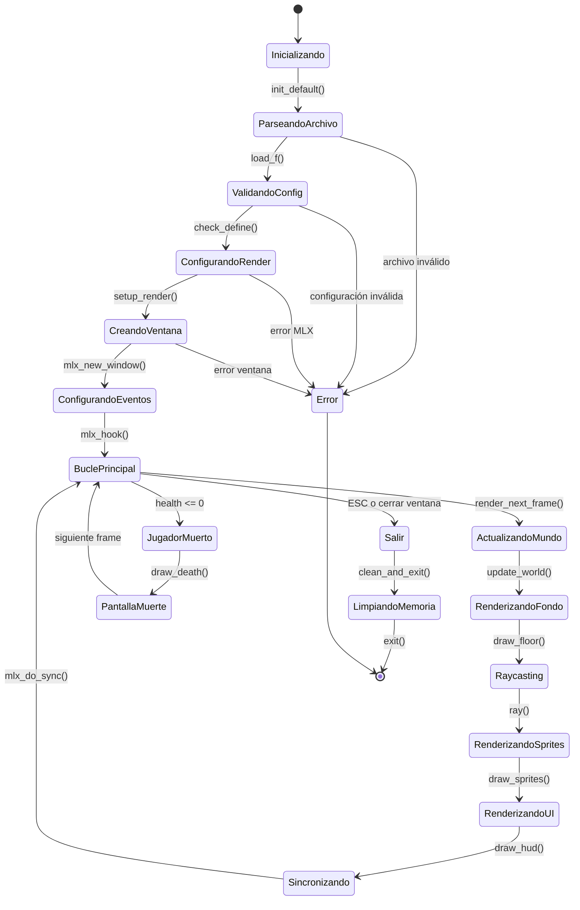

# 🎮 FLOWCHART COMPLETO - PROYECTO CUB3D

## Diagrama de Flujo Principal - Desde Inicio hasta Bucle del Juego

```mermaid
flowchart TD
    A[🚀 main] --> B[init_default]
    B --> C[set_bonus]
    C --> D[mlx_init]
    D --> E{¿MLX inicializado?}
    E -->|No| F[handle_error - FAIL_MLX]
    E -->|Sí| G[load_args]
    
    G --> H{¿argc == 2?}
    H -->|No| I[handle_error - ERROR_USAGE_CUB]
    H -->|Sí| J[check_iscub]
    
    J --> K{¿Archivo .cub?}
    K -->|No| L[handle_error - ERROR_FILE_TYPE]
    K -->|Sí| M[load_f - Parser Principal]
    
    M --> N[load_file - Cargar archivo]
    N --> O[read_argument - Parsear argumentos]
    O --> P[get_map_size - Calcular tamaño mapa]
    P --> Q[make_empty - Crear estructura mapa]
    Q --> R[load_map - Parsear mapa]
    R --> S[set_map - Convertir caracteres]
    S --> T[is_map_valid - Validar mapa]
    T --> U{¿Mapa válido?}
    U -->|No| V[handle_error - ERROR_MAP_UNCLOSED]
    U -->|Sí| W[handle_door_rotation]
    
    W --> X[check_define - Validar configuración]
    X --> Y{¿Configuración válida?}
    Y -->|No| Z[handle_error - Configuración inválida]
    Y -->|Sí| AA[setup_render]
    
    AA --> BB[mlx_new_window - Crear ventana]
    BB --> CC{¿Ventana creada?}
    CC -->|No| DD[handle_error - Error ventana]
    CC -->|Sí| EE[play_sound_alt - Sonido ambiente]
    
    EE --> FF[mlx_hook - Configurar eventos]
    FF --> GG[mlx_loop_hook - Configurar bucle]
    GG --> HH[mlx_loop - INICIAR BUCLE PRINCIPAL]
    
    HH --> II[render_next_frame]
    II --> JJ{¿Jugador muerto?}
    JJ -->|Sí| KK[draw_death]
    JJ -->|No| LL[update_world]
    
    LL --> MM[update_keybinds]
    MM --> NN{¿Modo bonus?}
    NN -->|Sí| OO[get_delay]
    NN -->|No| PP[update_motion]
    
    OO --> QQ{¿delay > FPS_BONUS?}
    QQ -->|Sí| RR[update_motion]
    RR --> SS[draw_sprites]
    SS --> TT[game->time++]
    TT --> UU[game->delay -= FPS_BONUS]
    UU --> QQ
    QQ -->|No| PP
    
    PP --> VV[draw_floor]
    VV --> WW{¿Hay textura suelo?}
    WW -->|Sí| XX[setup_floor]
    WW -->|No| YY[fill_img con color]
    
    XX --> ZZ[render_row_floor]
    ZZ --> AAA{¿Más filas suelo?}
    AAA -->|Sí| ZZ
    AAA -->|No| BBB{¿Modo BMP?}
    
    YY --> BBB
    BBB -->|No| CCC[draw_skybox]
    BBB -->|Sí| DDD[ray - RAYCASTING]
    
    CCC --> DDD
    DDD --> EEE[do_ray]
    EEE --> FFF{¿Hay colisión?}
    
    FFF -->|Sí| GGG[setup_line]
    FFF -->|No| HHH[cast_forward]
    
    GGG --> III{¿Qué tipo colisión?}
    III -->|Portal| JJJ[portal_render_pf]
    III -->|Portal vacío| KKK[e_portal_strip]
    III -->|Pared| LLL[set_img_strip]
    
    JJJ --> MMM{¿Más rayos?}
    KKK --> MMM
    LLL --> MMM
    HHH --> MMM
    
    MMM -->|Sí| EEE
    MMM -->|No| NNN[draw_sprites]
    
    NNN --> OOO[sprite_sort]
    OOO --> PPP{¿Más sprites?}
    PPP -->|Sí| QQQ[draw_sprite]
    PPP -->|No| RRR{¿Modo BMP?}
    
    QQQ --> SSS{¿Tipo sprite?}
    SSS -->|Puerta| TTT[handle_door]
    SSS -->|Goomba| UUU[handle_goomba]
    SSS -->|Otro| VVV[draw_sprite_line]
    
    TTT --> PPP
    UUU --> PPP
    VVV --> PPP
    
    RRR -->|No| WWW[mlx_put_image_to_window]
    RRR -->|Sí| XXX[mlx_do_sync]
    
    WWW --> YYY[draw_cursor]
    YYY --> ZZZ[draw_hud]
    ZZZ --> AAAA[render_hand]
    AAAA --> XXX
    
    XXX --> BBBB[game->time++]
    BBBB --> CCCC[mlx_do_sync]
    CCCC --> II
    
    KK --> CCCC
    
    F --> DDDD[clean_and_exit]
    I --> DDDD
    L --> DDDD
    V --> DDDD
    Z --> DDDD
    DD --> DDDD
    
    DDDD --> EEEE[clean_all]
    EEEE --> FFFF[clean_images]
    FFFF --> GGGG[destroy_img]
    GGGG --> HHHH[free_memory]
    HHHH --> IIII[exit]
    
    style A fill:#ff9999
    style HH fill:#99ff99
    style II fill:#99ff99
    style DDDD fill:#ffcccc
    style IIII fill:#ffcccc
```

## Diagrama de Flujo Detallado - Sistema de Parsing

## Diagrama de Flujo Detallado - Sistema de Renderizado

## Diagrama de Estados - Ciclo de Vida del Juego

## Resumen de Fases del Proyecto

| Fase | Función Principal | Descripción |
|------|------------------|-------------|
| **1. Inicialización** | `main()` | Configuración inicial y MLX |
| **2. Parsing** | `load_f()` | Carga y parseo del archivo .cub |
| **3. Validación** | `check_define()` | Verificación de configuración |
| **4. Renderizado** | `setup_render()` | Preparación del sistema gráfico |
| **5. Ventana** | `mlx_new_window()` | Creación de la ventana |
| **6. Eventos** | `mlx_hook()` | Configuración de eventos |
| **7. Bucle** | `mlx_loop()` | **BUCLE PRINCIPAL DEL JUEGO** |

## Puntos Clave del Flujo

### 🚀 **Inicio del Programa**
- Validación de argumentos
- Inicialización de MLX
- Carga del archivo .cub

### 📁 **Sistema de Parsing**
- Lectura línea por línea
- Parseo de argumentos (texturas, colores, resolución)
- Conversión del mapa a estructura de datos
- Validación del mapa

### 🎮 **Bucle Principal**
- **60 FPS** en modo bonus
- Actualización del mundo del juego
- Renderizado completo de la escena
- Manejo de eventos de entrada

### 🎨 **Sistema de Renderizado**
- **Raycasting** para paredes
- **Proyección perspectiva** para suelo
- **Billboard** para sprites
- **2D** para interfaz de usuario

### 🔄 **Ciclo Continuo**
- El juego entra en un bucle infinito
- Espera eventos del usuario
- Renderiza frames continuamente
- Solo sale con ESC o cerrar ventana

¡Este flowchart muestra el flujo completo desde el inicio del programa hasta el bucle principal donde el juego espera el movimiento del jugador!
