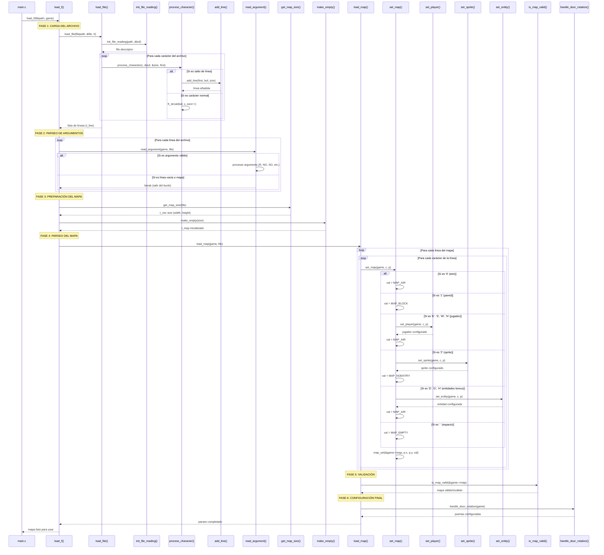
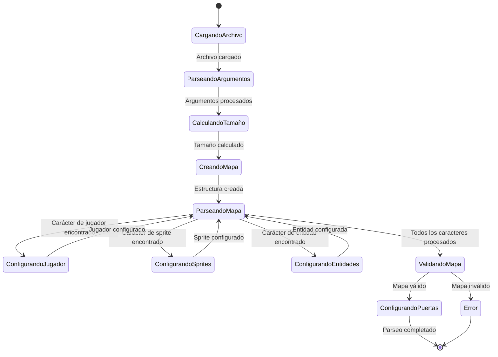

# UML - Flujo de Parseo del Archivo .cub en Cub3D

## Diagrama de Secuencia - Parseo del Mapa



## Diagrama de Clases - Estructuras de Datos

```mermaid
classDiagram
    class TLine {
        +char* line
        +int size
        +TLine* next
    }
    
    class TMap {
        +char* data
        +int width
        +int height
    }
    
    class TGame {
        +TMap map
        +TPlayer player
        +TLine* file
        +TWalls walls
        +TColor top_color
        +TColor bottom_color
        +int resx
        +int resy
        +bool bonus
    }
    
    class TPlayer {
        +TVec3d pos
        +TVec3d s_pos
        +double yaw
        +double pitch
        +float health
    }
    
    class TSprite {
        +TSpriteKind kind
        +TVec pos
        +TImg* texture
        +bool dead
    }
    
    class TGame --> TMap
    class TGame --> TPlayer
    class TGame --> TLine
    class TGame --> TSprite
```

## Diagrama de Flujo - Proceso de Parseo

```mermaid
flowchart TD
    A[Archivo .cub] --> B[load_f()]
    B --> C[load_file()]
    C --> D[init_file_reading()]
    D --> E[Leer archivo carácter por carácter]
    E --> F[process_character()]
    F --> G{¿Es salto de línea?}
    G -->|Sí| H[add_line()]
    G -->|No| I[ft_strcat()]
    H --> J[Crear lista enlazada t_line]
    I --> E
    J --> K[read_argument()]
    K --> L{¿Es argumento válido?}
    L -->|Sí| M[Procesar argumento]
    L -->|No| N[get_map_size()]
    M --> K
    N --> O[make_empty()]
    O --> P[load_map()]
    P --> Q[set_map()]
    Q --> R{¿Qué carácter?}
    R -->|'0'| S[MAP_AIR]
    R -->|'1'| T[MAP_BLOCK]
    R -->|'E','S','W','N'| U[set_player()]
    R -->|'2'| V[set_sprite()]
    R -->|'D','G','H'| W[set_entity()]
    R -->|' '| X[MAP_EMPTY]
    S --> Y[map_set()]
    T --> Y
    U --> Y
    V --> Y
    W --> Y
    X --> Y
    Y --> Z{¿Más caracteres?}
    Z -->|Sí| Q
    Z -->|No| AA[is_map_valid()]
    AA --> BB{¿Mapa válido?}
    BB -->|No| CC[ERROR]
    BB -->|Sí| DD[handle_door_rotation()]
    DD --> EE[¡Mapa listo!]
```

## Estados del Parseo



## Funciones Principales y sus Responsabilidades

| Función | Módulo | Responsabilidad |
|---------|--------|----------------|
| `load_f()` | parser_file_loader.c | Función principal de carga |
| `load_file()` | load_file.c | Lectura del archivo |
| `read_argument()` | parser_main.c | Parseo de argumentos |
| `get_map_size()` | parser_map_parser.c | Cálculo de dimensiones |
| `set_map()` | parser_map_parser.c | Conversión de caracteres |
| `set_player()` | parser_map_setter.c | Configuración del jugador |
| `set_sprite()` | parser_map_setter.c | Configuración de sprites |
| `is_map_valid()` | parser_map_validator.c | Validación del mapa |
| `handle_door_rotation()` | parser_map_parser.c | Configuración de puertas |

## Códigos de Caracteres del Mapa

| Carácter | Valor | Descripción |
|----------|-------|-------------|
| `'0'` | `MAP_AIR` | Espacio vacío |
| `'1'` | `MAP_BLOCK` | Pared |
| `' '` | `MAP_EMPTY` | Espacio vacío |
| `'E'` | `MAP_AIR` | Jugador mirando Este |
| `'S'` | `MAP_AIR` | Jugador mirando Sur |
| `'W'` | `MAP_AIR` | Jugador mirando Oeste |
| `'N'` | `MAP_AIR` | Jugador mirando Norte |
| `'2'` | `MAP_NOENTRY` | Sprite objeto |
| `'D'` | `MAP_NOENTRY` | Puerta (bonus) |
| `'G'` | `MAP_AIR` | Goomba (bonus) |
| `'H'` | `MAP_AIR` | Health kit (bonus) |
| `'P'` | `MAP_AIR` | Pathfinder (bonus) |

## Errores Posibles

| Error | Función | Descripción |
|-------|---------|-------------|
| `ERROR_COULD_NOT_LOAD_FILE` | `load_f()` | No se puede abrir el archivo |
| `ERROR_FORMAT` | `load_map()` | Formato de carácter inválido |
| `ERROR_MAP_UNCLOSED` | `load_map()` | Mapa no está cerrado |
| `ERROR_DUPLICATE_PLAYER` | `set_player()` | Jugador duplicado |
| `ERROR_DUPLICATE_PATHFINDER` | `set_pathfinder()` | Pathfinder duplicado |
| `ERROR_MAP_GRID_EMPTY` | `load_f()` | Mapa vacío |
| `ERROR_FAILED_INIT_MAP` | `load_f()` | Fallo al inicializar mapa |
