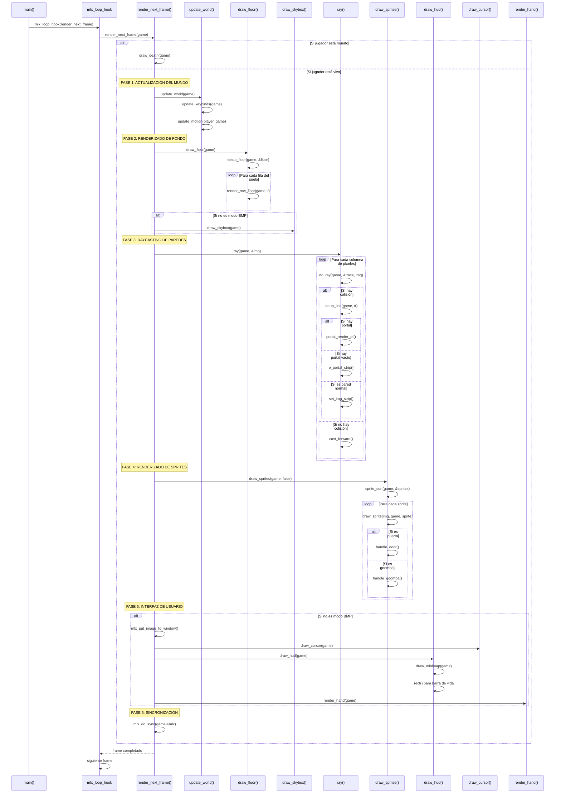
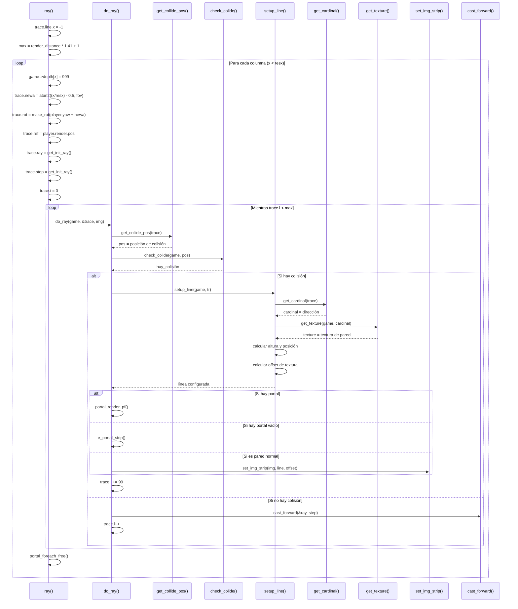
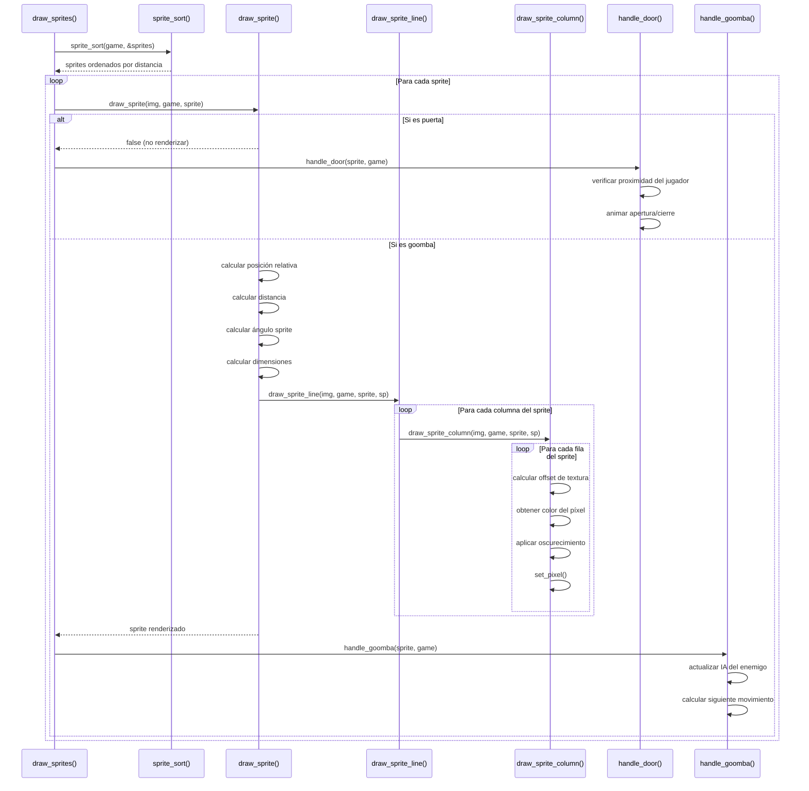
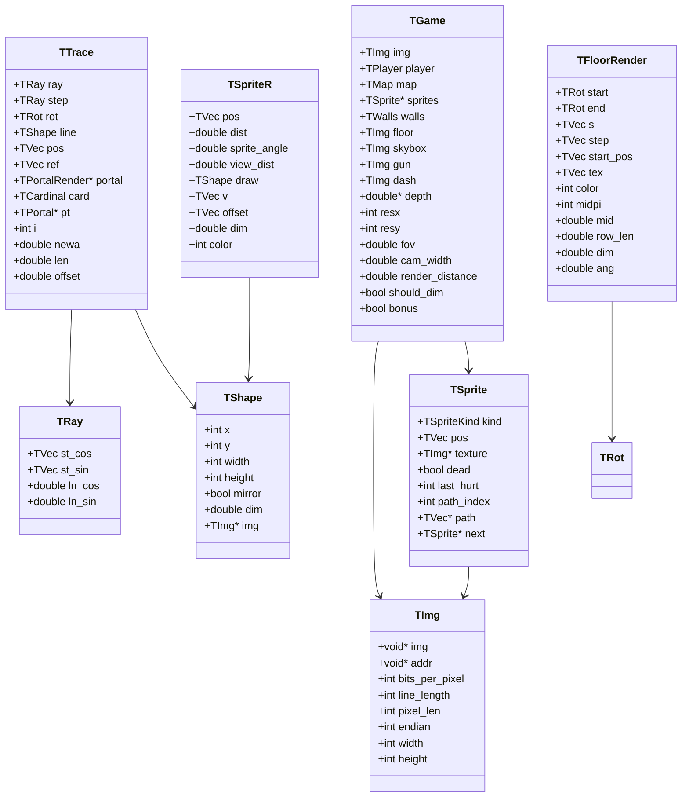
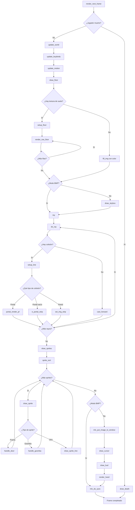
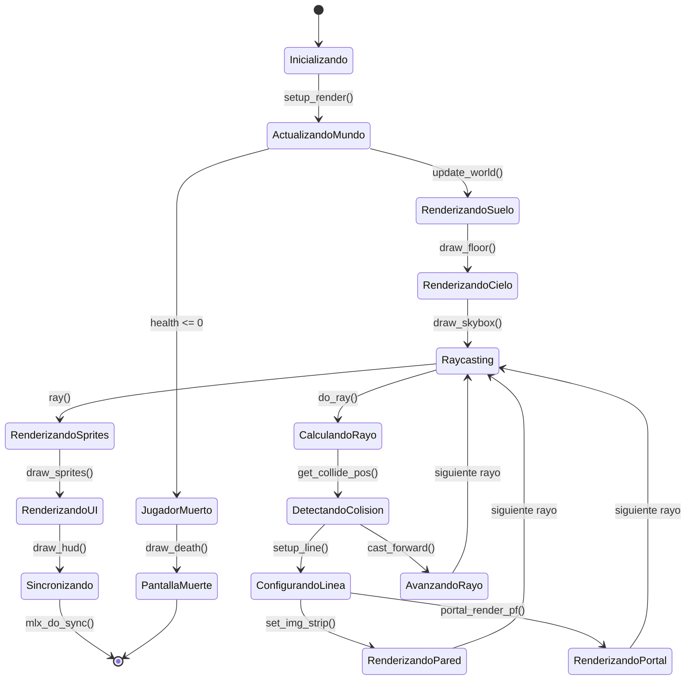

# UML - Sistema de Renderizado en Cub3D

## Diagrama de Secuencia - Bucle Principal de Renderizado

## Diagrama de Secuencia - Raycasting Detallado

## Diagrama de Secuencia - Renderizado de Sprites

## Diagrama de Clases - Sistema de Renderizado

## Diagrama de Flujo - Proceso de Renderizado

## Diagrama de Estados - Ciclo de Renderizado

## Funciones Principales del Sistema de Renderizado

| Función | Módulo | Responsabilidad |
|---------|--------|----------------|
| `render_next_frame()` | main.c | Bucle principal de renderizado |
| `update_world()` | main.c | Actualización del estado del juego |
| `draw_floor()` | render_floor.c | Renderizado del suelo texturizado |
| `draw_skybox()` | render_textures.c | Renderizado del cielo |
| `ray()` | raycast_engine.c | Motor de raycasting principal |
| `do_ray()` | raycast_engine.c | Procesamiento de un rayo individual |
| `setup_line()` | raycast_engine.c | Configuración de línea de pared |
| `draw_sprites()` | game_sprite_renderer.c | Renderizado de sprites |
| `draw_sprite()` | game_sprite_renderer.c | Renderizado de sprite individual |
| `draw_hud()` | render_hud.c | Interfaz de usuario |
| `draw_minimap()` | render_minimap.c | Minimapa |
| `draw_cursor()` | render_hud.c | Cruz de mira |
| `render_hand()` | render_hud.c | Arma en mano |

## Tipos de Renderizado

| Tipo | Función | Descripción |
|------|---------|-------------|
| **Paredes** | `set_img_strip()` | Raycasting con texturas |
| **Suelo** | `render_row_floor()` | Proyección perspectiva |
| **Cielo** | `draw_skybox()` | Textura panorámica |
| **Sprites** | `draw_sprite_line()` | Proyección billboard |
| **UI** | `rect()` | Elementos 2D |
| **Portales** | `portal_render_pf()` | Efectos especiales |

## Optimizaciones del Sistema

| Optimización | Implementación | Beneficio |
|--------------|----------------|-----------|
| **Depth Buffer** | `game->depth[]` | Evita overdraw |
| **Sprite Sorting** | `sprite_sort()` | Renderizado correcto |
| **Culling** | `render_distance` | Evita renderizado lejano |
| **Oscurecimiento** | `color_dim()` | Efecto de distancia |
| **Portal System** | `portal_render_pf()` | Efectos avanzados |
| **Big Pixels** | `set_big_pixel()` | Renderizado rápido del suelo |

## Configuración de Renderizado

| Parámetro | Variable | Descripción |
|-----------|----------|-------------|
| **Resolución** | `game->resx`, `game->resy` | Tamaño de pantalla |
| **FOV** | `game->fov` | Campo de visión |
| **Distancia** | `game->render_distance` | Distancia máxima de renderizado |
| **Oscurecimiento** | `game->should_dim` | Efecto de distancia |
| **Modo Bonus** | `game->bonus` | Funciones adicionales |
| **Modo BMP** | `game->bmp` | Modo de captura |

## Errores de Renderizado

| Error | Causa | Solución |
|-------|-------|----------|
| **Pantalla negra** | Texturas no cargadas | Verificar archivos .xpm |
| **Sprites incorrectos** | Depth buffer mal configurado | Verificar `game->depth` |
| **Distorsión** | FOV incorrecto | Ajustar `game->fov` |
| **Rendimiento bajo** | Render distance muy alta | Reducir `render_distance` |
| **Portales no funcionan** | Texturas de diferente tamaño | Verificar dimensiones |
